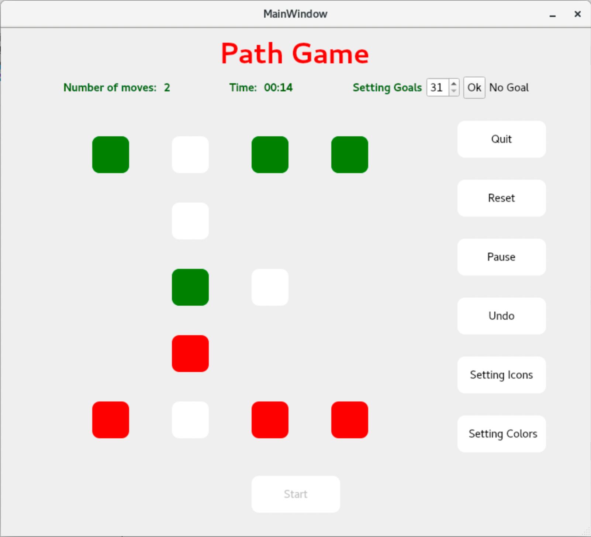
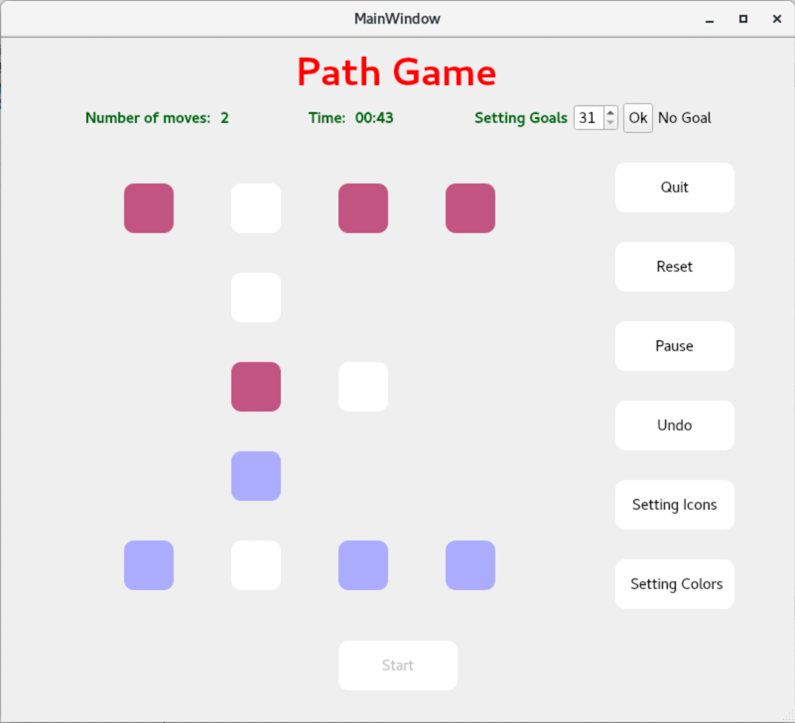

# GUI-Game-Path
How the user interface looks like

1. When starting the game

2. When changing the color of items in the game

## I. How to Use the Program

1. Run the program to launch the main window.
2. Ensure that you have clicked the start button; otherwise, the button will not be movable.
3. Click the start button to move the button and start the timer.
4. To set a goal, click the OK button, and the goal will appear.
5. Choose two colors for the game board.
6. Choose two icons for the game, and the last two icons clicked will be displayed.
7. Use the pause button to stop the timer.
8. Click the reset button to reset the game.
9. To undo a move, use the undo button.
10. Use the quit button to exit the game.

## II. Rules of the Game

The purpose of the game is to move green and red buttons so that they are in opposite positions compared to the initial setup. At the beginning, the buttons are arranged as shown in the drawn picture, with green buttons at the top and red buttons at the bottom. The objective is to reach a situation where green buttons are at the bottom, and red buttons are at the top. This can be achieved in a minimum of 31 moves. It is not allowed to move a button over another one, but moves can be made along a path of empty places.

## III. Functionalities

### Minimum Requirements

1. **Displaying the Game Grid:** The program displays the game grid with buttons and icons.

2. **Choosing a Piece to be Moved and Its New Location:** You can choose a piece to move and select its new location.

3. **Telling the Amount of Moves Made:** The program keeps track of the number of moves made and displays it to the user.

4. **Resetting the Game:** You can reset the game at any point.

5. **Timer:** The program features a timer that tells you the time used so far.

### Extra Features

1. **Choose Colors of Game Pieces:** Customize the colors of the game pieces according to your preferences.

2. **Add Icons to Buttons:** Select icons to be displayed on the buttons, making the game more visually appealing.

3. **Background Changes When Goals Are Achieved:** When you achieve the game goals, the background changes to indicate success.

4. **Set Goals:** You can set goals to provide additional challenges and objectives.

5. **Pause the Timer:** Use the pause button to stop the timer temporarily.

6. **Undo Moves:** The undo button allows you to reverse previous moves, providing more flexibility in your gameplay.

Feel free to explore these functionalities and enjoy playing the Path Game!

Happy gaming! 🎮🚀
